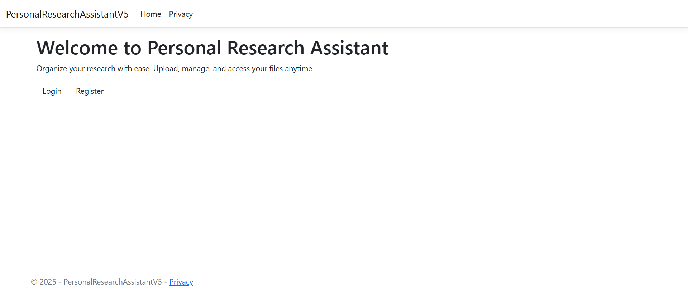
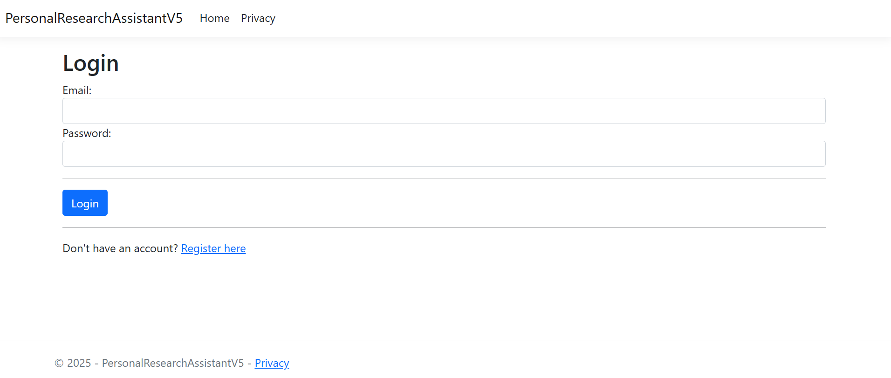
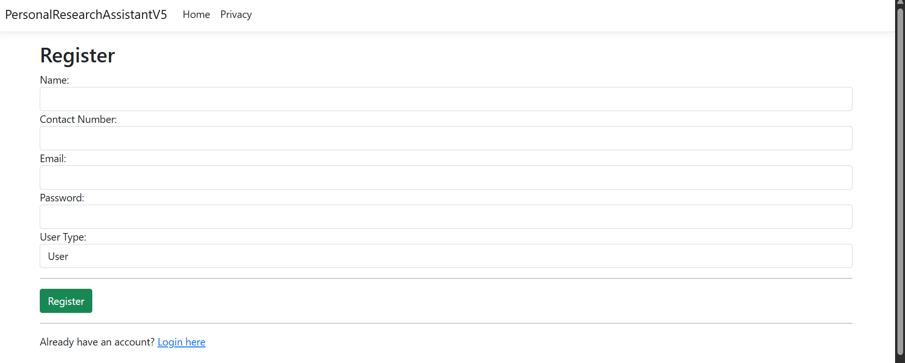
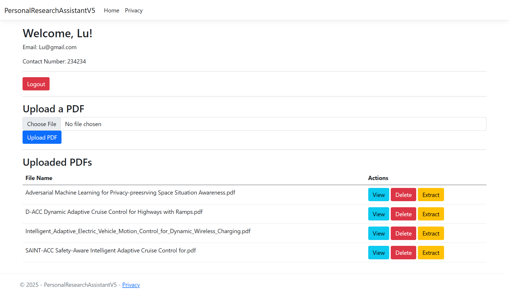
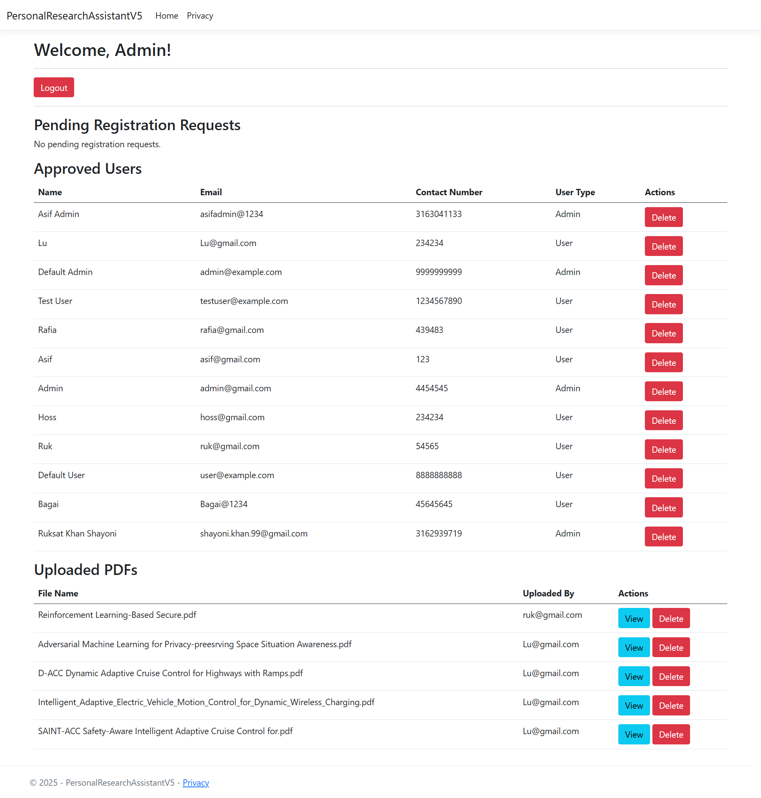
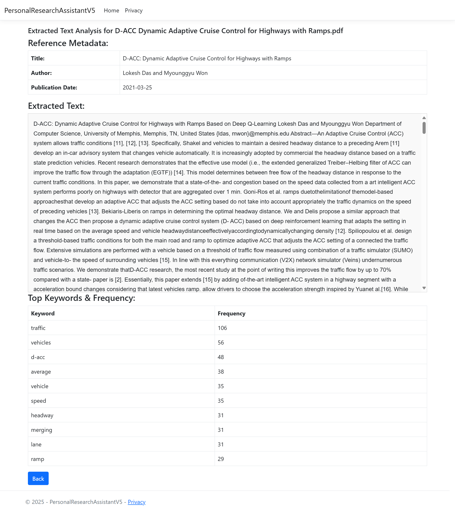

# Personal Research Assistant

**Personal Research Assistant** is a role-based ASP.NET Core MVC web application that helps researchers organize their work. Users can register, login, upload research PDFs, extract content using NLP, and manage files through an intuitive interface. The system supports **Admin** and **User** roles with controlled access to functionalities.


---

## Features

- **User Registration with Role Selection (Admin/User)**
- **Login Authentication using ASP.NET Identity**
- **Admin Approval System** for new users
- **PDF Upload & View**
- **Text Extraction and Keyword Frequency Analysis using NLP**
- **Role-Based Dashboards (Admin/User)**
- **Admin-Only User Management (Approve/Decline/Delete)**
- **Smart Metadata Extraction from PDFs**
- **Modern, Clean Interface with Alerts and Validations**


---

## Project Interface Preview

### Home Page


### Login Page


### Registration Page


### User Dashboard


### Admin Dashboard


### Metadata Extraction


---

## Technologies Used

- ASP.NET Core MVC (.NET 8)
- Entity Framework Core (MySQL)
- Identity Framework for Authentication & Authorization
- iTextSharp for PDF text extraction
- Custom keyword analysis using C#
- Bootstrap for responsive design

---

## Project Structure

```
/Controllers
  - AccountController.cs  --> Handles registration, login, logout
  - HomeController.cs     --> Main user/admin home and PDF functionalities
  - PdfController.cs      --> PDF upload/delete logic

/Models
  - ApplicationUser.cs
  - RegisterViewModel.cs
  - LoginViewModel.cs
  - UserPdf.cs
  - AdminHomeViewModel.cs
  - ExtractTextViewModel.cs

/Views
  /Account
    - Login.cshtml
    - Register.cshtml
  /Home
    - AdminHome.cshtml
    - UserHome.cshtml
    - Index.cshtml
    - ExtractedText.cshtml

/wwwroot
  - uploads/          --> Stores uploaded PDFs
  - css/              --> Custom styles
  - js/               --> Client-side scripts
  - python/           --> Placeholder for NLP processing logic
```

---

## Role-Based Access & Routing

- `Authorize(Roles = "Admin")` restricts access to Admin-only views/actions.
- `Authorize(Roles = "User")` restricts regular users to their dashboard only.
- Users awaiting approval are tracked via roles: **users without a role** appear as pending.
- Based on assigned role, login redirects user to either:
  - `/Home/AdminHome` (Admin)
  - `/Home/UserHome` (User)

---

## PDF Text Extraction and NLP Analysis

- Upload PDFs using the User Dashboard.
- Admin can view all user uploads.
- Extraction uses **iTextSharp** to get text, author, title, and publication date.
- Keyword analysis uses C# LINQ logic to tokenize, remove stopwords, and calculate word frequency.

---


## Author

**S M Asif Hossain**  
`https://github.com/smAsifHossain` 


---
